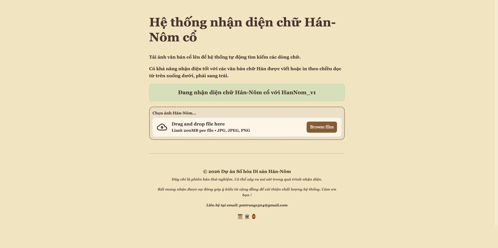

# 🏯 Hệ thống nhận diện chữ Hán-Nôm cổ

Ứng dụng nhận diện vùng văn bản Hán-Nôm sử dụng mô hình PaddleOCR v4 tùy chỉnh.

## ✨ Tính năng
* **Giao diện cổ điển**: Thiết kế phong cách giấy bản, phông chữ Georgia sang trọng.
* **Mobile Friendly**: Tối ưu hiển thị trên các thiết bị di động.
* **Model tùy chỉnh**: Sử dụng model PP-OCRv4 đã được tinh chỉnh.

## 🛠️ Cách cài đặt
1. Clone dự án:  
  `git clone https://github.com/fuzziouzz/ChineseTextDectectionWebsite.git`
2. Tạo môi trường ảo và kích hoạt:  
   `python -m venv env` sau đó `source env/bin/activate`
4. Cài đặt thư viện:  
   `pip install -r requirements.txt`
6. Chạy ứng dụng:  
   `streamlit run HanNomOCR.py`
